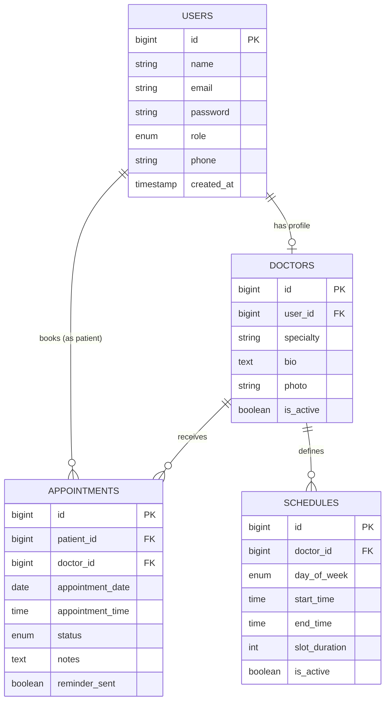
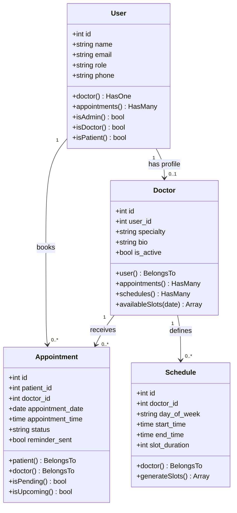
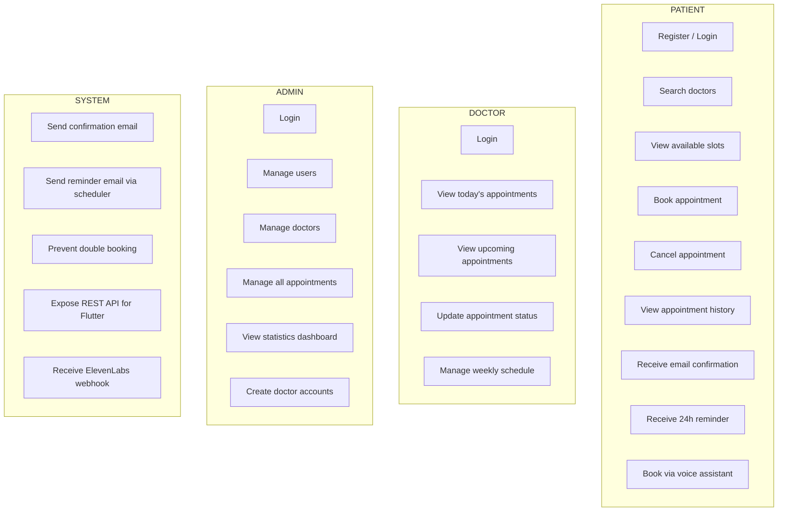
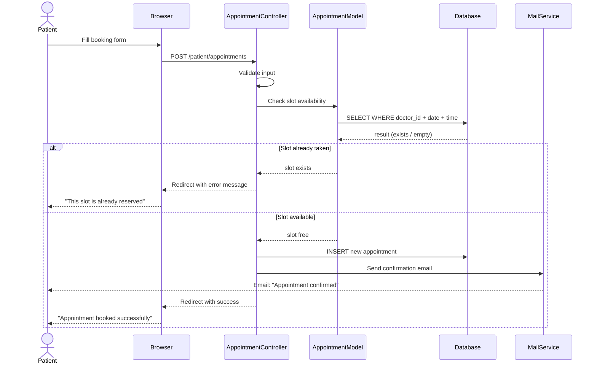
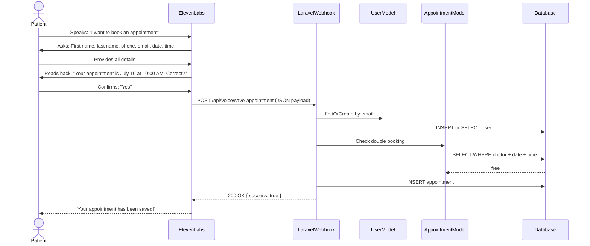

# KIRO AI — MASTER PROMPT
# Medical Appointment Management System
# Full System Specification + UML + Page-by-Page Guide

---

## INSTRUCTIONS FOR KIRO AI

You are a Senior Laravel Developer and Software Architect.
Build a complete Medical Appointment Management System from scratch.
Follow every specification below exactly.
Generate all files: migrations, models, controllers, views, API, tests, and UML diagrams.
The project must be production-ready, beginner-readable, and fully commented.

---

## 1. PROJECT OVERVIEW

**Project Name:** Medical Appointment Management System
**Type:** Web platform + REST API + Flutter mobile + AI Voice Assistant
**Student Level:** Second-year Software Development (explain code clearly)

**Core purpose:**
Patients book appointments with doctors online.
Doctors manage their schedules and view their patient list.
Admins supervise the entire platform.
A Flutter mobile app connects to the same database via REST API.
An ElevenLabs AI voice assistant can book appointments by voice.

---

## 2. TECHNOLOGY STACK

```
Backend:      Laravel 12
Auth:         Laravel Breeze (Blade stack)
Database:     MySQL 8
ORM:          Eloquent
API Auth:     Laravel Sanctum
Frontend:     Blade + Tailwind CSS v3
Mobile:       Flutter (API consumer only)
AI Voice:     ElevenLabs Voice Agent (webhook integration)
Mail:         Laravel Mail + Mailtrap (dev) / SMTP (prod)
Scheduler:    Laravel Task Scheduling + Cron
Queue:        Laravel Queue (database driver)
```

---

## 3. USER ROLES

| Role    | Description                                     |
|---------|-------------------------------------------------|
| patient | Books and manages their own appointments        |
| doctor  | Views appointments, manages availability        |
| admin   | Full platform control, statistics, user mgmt    |

Every user has a `role` column: `enum('patient','doctor','admin')`.
Default role on register: `patient`.
Admin and doctor accounts are created by the admin panel only.

---

## 4. DATABASE SCHEMA

### 4.1 Table: users
```sql
id              BIGINT UNSIGNED AUTO_INCREMENT PRIMARY KEY
name            VARCHAR(255) NOT NULL
email           VARCHAR(255) UNIQUE NOT NULL
email_verified_at TIMESTAMP NULL
password        VARCHAR(255) NOT NULL
role            ENUM('patient','doctor','admin') DEFAULT 'patient'
phone           VARCHAR(20) NULL
remember_token  VARCHAR(100) NULL
created_at      TIMESTAMP
updated_at      TIMESTAMP
```

### 4.2 Table: doctors
```sql
id          BIGINT UNSIGNED AUTO_INCREMENT PRIMARY KEY
user_id     BIGINT UNSIGNED NOT NULL (FK → users.id CASCADE DELETE)
specialty   VARCHAR(255) NOT NULL
bio         TEXT NULL
photo       VARCHAR(255) NULL
is_active   TINYINT(1) DEFAULT 1
created_at  TIMESTAMP
updated_at  TIMESTAMP
```

### 4.3 Table: schedules
```sql
id              BIGINT UNSIGNED AUTO_INCREMENT PRIMARY KEY
doctor_id       BIGINT UNSIGNED NOT NULL (FK → doctors.id CASCADE DELETE)
day_of_week     ENUM('monday','tuesday','wednesday','thursday','friday','saturday','sunday')
start_time      TIME NOT NULL
end_time        TIME NOT NULL
slot_duration   INT DEFAULT 30  (minutes per appointment slot)
is_active       TINYINT(1) DEFAULT 1
created_at      TIMESTAMP
updated_at      TIMESTAMP
```

### 4.4 Table: appointments
```sql
id                BIGINT UNSIGNED AUTO_INCREMENT PRIMARY KEY
patient_id        BIGINT UNSIGNED NOT NULL (FK → users.id CASCADE DELETE)
doctor_id         BIGINT UNSIGNED NOT NULL (FK → doctors.id CASCADE DELETE)
appointment_date  DATE NOT NULL
appointment_time  TIME NOT NULL
status            ENUM('pending','confirmed','cancelled','completed') DEFAULT 'pending'
notes             TEXT NULL
reminder_sent     TINYINT(1) DEFAULT 0
created_at        TIMESTAMP
updated_at        TIMESTAMP
UNIQUE KEY no_double_booking (doctor_id, appointment_date, appointment_time)
```

### 4.5 Table: personal_access_tokens (auto-created by Sanctum)
Standard Sanctum table — run `php artisan vendor:publish --sanctum`.

---

## 5. ENTITY RELATIONSHIP DIAGRAM (UML — Mermaid syntax)



---

## 6. CLASS DIAGRAM (UML — Mermaid syntax)



---

## 7. USE CASE DIAGRAM (UML — Mermaid syntax)



---

## 8. SEQUENCE DIAGRAM — Booking an appointment (UML — Mermaid syntax)



---

## 9. SEQUENCE DIAGRAM — ElevenLabs Voice Booking



---

## 10. FOLDER STRUCTURE TO GENERATE

```
app/
├── Console/
│   └── Commands/
│       └── SendAppointmentReminders.php
├── Http/
│   ├── Controllers/
│   │   ├── Admin/
│   │   │   ├── DashboardController.php
│   │   │   ├── UserController.php
│   │   │   ├── DoctorController.php
│   │   │   └── AppointmentController.php
│   │   ├── Doctor/
│   │   │   ├── DashboardController.php
│   │   │   └── ScheduleController.php
│   │   ├── Patient/
│   │   │   ├── DashboardController.php
│   │   │   └── AppointmentController.php
│   │   └── Api/
│   │       ├── AuthController.php
│   │       ├── DoctorController.php
│   │       ├── AppointmentController.php
│   │       └── VoiceAppointmentController.php
│   └── Middleware/
│       └── CheckRole.php
├── Mail/
│   ├── AppointmentConfirmation.php
│   └── AppointmentReminder.php
├── Models/
│   ├── User.php
│   ├── Doctor.php
│   ├── Appointment.php
│   └── Schedule.php
database/
├── migrations/
│   ├── xxxx_create_users_table.php           (Breeze default + role + phone)
│   ├── xxxx_create_doctors_table.php
│   ├── xxxx_create_schedules_table.php
│   └── xxxx_create_appointments_table.php
├── seeders/
│   ├── AdminSeeder.php
│   ├── DoctorSeeder.php
│   └── DatabaseSeeder.php
resources/
├── views/
│   ├── layouts/
│   │   ├── app.blade.php
│   │   ├── admin.blade.php
│   │   ├── doctor.blade.php
│   │   └── patient.blade.php
│   ├── admin/
│   │   ├── dashboard.blade.php
│   │   ├── users/index.blade.php
│   │   ├── doctors/index.blade.php
│   │   └── appointments/index.blade.php
│   ├── doctor/
│   │   ├── dashboard.blade.php
│   │   ├── appointments/index.blade.php
│   │   └── schedules/index.blade.php
│   ├── patient/
│   │   ├── dashboard.blade.php
│   │   ├── appointments/index.blade.php
│   │   ├── appointments/create.blade.php
│   │   └── doctors/index.blade.php
│   └── emails/
│       ├── appointment-confirmation.blade.php
│       └── appointment-reminder.blade.php
routes/
│   ├── web.php
│   ├── api.php
│   └── console.php
```

---

## 11. ALL PAGES — FULL SPECIFICATION

### PAGE 1: /register — Patient Registration
**Route:** GET/POST `/register`
**Controller:** `Auth\RegisteredUserController` (Breeze default)
**Fields:**
- Full name (text, required)
- Email (email, required, unique)
- Phone number (text, optional)
- Password (password, min 8)
- Confirm password
- Role is always set to `patient` automatically

**Validation rules:**
```php
'name'     => 'required|string|max:255',
'email'    => 'required|email|unique:users',
'phone'    => 'nullable|string|max:20',
'password' => 'required|confirmed|min:8',
```
**After success:** Redirect to `/patient/dashboard`
**UI:** Tailwind card, centered, white background, logo at top

---

### PAGE 2: /login — Login
**Route:** GET/POST `/login`
**Controller:** `Auth\AuthenticatedSessionController` (Breeze default)
**Fields:**
- Email
- Password
- Remember me checkbox
**After success:** Redirect based on role:
```php
match($user->role) {
    'admin'   => redirect('/admin/dashboard'),
    'doctor'  => redirect('/doctor/dashboard'),
    'patient' => redirect('/patient/dashboard'),
}
```
**Error:** "These credentials do not match our records."

---

### PAGE 3: /patient/dashboard — Patient Dashboard
**Route:** GET `/patient/dashboard`
**Middleware:** `auth`, `role:patient`
**Controller:** `Patient\DashboardController@index`
**Displays:**
- Welcome message with patient name
- Card: Next upcoming appointment (date, time, doctor name)
- Card: Total appointments count
- Card: Cancelled appointments count
- Table: Last 5 appointments with status badges
- Button: "Book New Appointment"

**Data query:**
```php
$upcoming = Appointment::where('patient_id', auth()->id())
    ->where('appointment_date', '>=', today())
    ->where('status', '!=', 'cancelled')
    ->with('doctor.user')
    ->orderBy('appointment_date')
    ->first();

$history = Appointment::where('patient_id', auth()->id())
    ->with('doctor.user')
    ->latest()
    ->take(5)
    ->get();
```

---

### PAGE 4: /patient/appointments — My Appointments
**Route:** GET `/patient/appointments`
**Middleware:** `auth`, `role:patient`
**Controller:** `Patient\AppointmentController@index`
**Displays:**
- Paginated table (10 per page) of all appointments
- Columns: Doctor name, Specialty, Date, Time, Status, Actions
- Status badges: pending=yellow, confirmed=green, cancelled=red, completed=blue
- Cancel button (only for pending/confirmed appointments in the future)
- Filter tabs: All / Upcoming / Past / Cancelled

---

### PAGE 5: /patient/appointments/create — Book Appointment
**Route:** GET `/patient/appointments/create`
**Controller:** `Patient\AppointmentController@create`
**Step 1 — Choose Doctor:**
- Search bar (filter by name or specialty)
- Doctor cards showing: photo, name, specialty, bio snippet
- "Select" button per doctor

**Step 2 — Choose Date & Time:**
- Date picker (only future dates, only days matching doctor's schedule)
- Available time slots shown as clickable buttons
- Unavailable slots shown as greyed out (already booked)

**Step 3 — Confirm:**
- Summary: Doctor, date, time, optional notes textarea
- Submit button

**POST route:** POST `/patient/appointments`
**Validation:**
```php
'doctor_id'        => 'required|exists:doctors,id',
'appointment_date' => 'required|date|after_or_equal:today',
'appointment_time' => 'required|date_format:H:i',
'notes'            => 'nullable|string|max:500',
```

**Double-booking check (REQUIRED):**
```php
$exists = Appointment::where('doctor_id', $request->doctor_id)
    ->where('appointment_date', $request->appointment_date)
    ->where('appointment_time', $request->appointment_time)
    ->whereNotIn('status', ['cancelled'])
    ->exists();

if ($exists) {
    return back()->withErrors([
        'appointment_time' => 'This appointment slot is already reserved. Please choose another date or time.'
    ])->withInput();
}
```

---

### PAGE 6: /doctor/dashboard — Doctor Dashboard
**Route:** GET `/doctor/dashboard`
**Middleware:** `auth`, `role:doctor`
**Controller:** `Doctor\DashboardController@index`
**Displays:**
- Today's date and doctor name
- Card: Today's appointments count
- Card: Total upcoming appointments
- Table: Today's appointments (patient name, time, status, notes)
- Table: Next 7 days appointments
- Quick status update buttons per appointment row

**Data query:**
```php
$doctor = auth()->user()->doctor;

$todayAppointments = Appointment::where('doctor_id', $doctor->id)
    ->whereDate('appointment_date', today())
    ->with('patient')
    ->orderBy('appointment_time')
    ->get();
```

---

### PAGE 7: /doctor/schedules — Manage Schedule
**Route:** GET/POST `/doctor/schedules`
**Middleware:** `auth`, `role:doctor`
**Controller:** `Doctor\ScheduleController`
**Displays:**
- Weekly grid: Monday to Sunday
- Per day: start time, end time, slot duration, active toggle
- Save button per row or global save

**POST creates or updates schedules:**
```php
foreach ($request->schedules as $day => $data) {
    Schedule::updateOrCreate(
        ['doctor_id' => $doctor->id, 'day_of_week' => $day],
        [
            'start_time'    => $data['start_time'],
            'end_time'      => $data['end_time'],
            'slot_duration' => $data['slot_duration'],
            'is_active'     => $data['is_active'] ?? false,
        ]
    );
}
```

---

### PAGE 8: /doctor/appointments — Doctor Appointments
**Route:** GET `/doctor/appointments`
**Middleware:** `auth`, `role:doctor`
**Controller:** `Doctor\DashboardController@appointments`
**Displays:**
- Filter: by date, by status
- Table: patient name, phone, date, time, status, notes, action buttons
- Status update: doctor can set confirmed / completed / cancelled

---

### PAGE 9: /admin/dashboard — Admin Dashboard
**Route:** GET `/admin/dashboard`
**Middleware:** `auth`, `role:admin`
**Controller:** `Admin\DashboardController@index`
**Displays 4 stat cards:**
- Total patients
- Total active doctors
- Total appointments this month
- Pending appointments

**Chart: Monthly appointments (last 12 months)**
Use Chart.js via CDN.
```php
$monthly = Appointment::selectRaw('MONTH(appointment_date) as month, COUNT(*) as total')
    ->whereYear('appointment_date', now()->year)
    ->groupBy('month')
    ->orderBy('month')
    ->pluck('total', 'month');
```

**Recent activity table:** Last 10 appointments across all doctors.

---

### PAGE 10: /admin/users — Manage Users
**Route:** Resource `/admin/users`
**Middleware:** `auth`, `role:admin`
**Controller:** `Admin\UserController` (resourceful)
**Displays:**
- Searchable, sortable table: name, email, role, phone, created date, actions
- Edit button: change name, email, phone, role
- Delete button (soft confirm modal)
- Filter by role

---

### PAGE 11: /admin/doctors — Manage Doctors
**Route:** Resource `/admin/doctors`
**Middleware:** `auth`, `role:admin`
**Controller:** `Admin\DoctorController`
**Displays:**
- Table: doctor name, specialty, status, appointments count
- Create: form to create a user with role=doctor AND doctor profile
- Edit: specialty, bio, photo upload, active toggle
- Deactivate: sets is_active=false (doctor no longer visible to patients)

---

### PAGE 12: /admin/appointments — All Appointments
**Route:** GET `/admin/appointments`
**Middleware:** `auth`, `role:admin`
**Controller:** `Admin\AppointmentController@index`
**Displays:**
- Full appointments table with filters: doctor, patient, date range, status
- Export to CSV button
- Status can be changed by admin

---

## 12. COMPLETE ROUTE FILE

### routes/web.php
```php
<?php
use Illuminate\Support\Facades\Route;
use App\Http\Controllers\Patient;
use App\Http\Controllers\Doctor;
use App\Http\Controllers\Admin;

// Root redirect
Route::get('/', fn() => redirect('/login'));

// Breeze auth routes (register, login, logout, password reset, profile)
require __DIR__.'/auth.php';

// ── PATIENT ──────────────────────────────────────────────
Route::middleware(['auth', 'role:patient'])
    ->prefix('patient')
    ->name('patient.')
    ->group(function () {
        Route::get('/dashboard', [Patient\DashboardController::class, 'index'])->name('dashboard');
        Route::get('/doctors',   [Patient\DoctorController::class,   'index'])->name('doctors.index');
        Route::get('/appointments',         [Patient\AppointmentController::class, 'index'])->name('appointments.index');
        Route::get('/appointments/create',  [Patient\AppointmentController::class, 'create'])->name('appointments.create');
        Route::post('/appointments',        [Patient\AppointmentController::class, 'store'])->name('appointments.store');
        Route::delete('/appointments/{id}', [Patient\AppointmentController::class, 'cancel'])->name('appointments.cancel');
    });

// ── DOCTOR ───────────────────────────────────────────────
Route::middleware(['auth', 'role:doctor'])
    ->prefix('doctor')
    ->name('doctor.')
    ->group(function () {
        Route::get('/dashboard',    [Doctor\DashboardController::class, 'index'])->name('dashboard');
        Route::get('/appointments', [Doctor\DashboardController::class, 'appointments'])->name('appointments');
        Route::patch('/appointments/{id}/status', [Doctor\DashboardController::class, 'updateStatus'])->name('appointments.status');
        Route::get('/schedules',    [Doctor\ScheduleController::class, 'index'])->name('schedules');
        Route::post('/schedules',   [Doctor\ScheduleController::class, 'store'])->name('schedules.store');
    });

// ── ADMIN ────────────────────────────────────────────────
Route::middleware(['auth', 'role:admin'])
    ->prefix('admin')
    ->name('admin.')
    ->group(function () {
        Route::get('/dashboard', [Admin\DashboardController::class, 'index'])->name('dashboard');
        Route::resource('/users',        Admin\UserController::class);
        Route::resource('/doctors',      Admin\DoctorController::class);
        Route::resource('/appointments', Admin\AppointmentController::class)->only(['index','show','destroy']);
        Route::patch('/appointments/{id}/status', [Admin\AppointmentController::class, 'updateStatus'])->name('appointments.status');
    });
```

### routes/api.php
```php
<?php
use Illuminate\Support\Facades\Route;
use App\Http\Controllers\Api;

// ── PUBLIC ───────────────────────────────────────────────
Route::post('/register', [Api\AuthController::class, 'register']);
Route::post('/login',    [Api\AuthController::class, 'login']);

// Voice assistant webhook (ElevenLabs)
Route::post('/voice/save-appointment', [Api\VoiceAppointmentController::class, 'save']);

// ── PROTECTED (Sanctum token required) ───────────────────
Route::middleware('auth:sanctum')->group(function () {
    Route::post('/logout', [Api\AuthController::class, 'logout']);
    Route::get('/profile', [Api\AuthController::class, 'profile']);
    Route::put('/profile', [Api\AuthController::class, 'updateProfile']);

    Route::get('/doctors',      [Api\DoctorController::class, 'index']);
    Route::get('/doctors/{id}', [Api\DoctorController::class, 'show']);
    Route::get('/doctors/{id}/slots', [Api\DoctorController::class, 'availableSlots']);

    Route::get('/appointments',          [Api\AppointmentController::class, 'index']);
    Route::post('/appointments',         [Api\AppointmentController::class, 'store']);
    Route::put('/appointments/{id}',     [Api\AppointmentController::class, 'update']);
    Route::delete('/appointments/{id}',  [Api\AppointmentController::class, 'cancel']);
});
```

### routes/console.php
```php
<?php
use Illuminate\Support\Facades\Schedule;

Schedule::command('appointments:send-reminders')->dailyAt('08:00');
```

---

## 13. COMPLETE MODELS

### User.php
```php
<?php
namespace App\Models;

use Illuminate\Foundation\Auth\User as Authenticatable;
use Illuminate\Notifications\Notifiable;
use Laravel\Sanctum\HasApiTokens;

class User extends Authenticatable
{
    use HasApiTokens, Notifiable;

    protected $fillable = ['name', 'email', 'password', 'role', 'phone'];

    protected $hidden = ['password', 'remember_token'];

    protected $casts = ['email_verified_at' => 'datetime', 'password' => 'hashed'];

    public function doctor()
    {
        return $this->hasOne(Doctor::class);
    }

    public function appointments()
    {
        return $this->hasMany(Appointment::class, 'patient_id');
    }

    public function isAdmin(): bool  { return $this->role === 'admin'; }
    public function isDoctor(): bool { return $this->role === 'doctor'; }
    public function isPatient(): bool{ return $this->role === 'patient'; }
}
```

### Doctor.php
```php
<?php
namespace App\Models;

use Illuminate\Database\Eloquent\Model;

class Doctor extends Model
{
    protected $fillable = ['user_id', 'specialty', 'bio', 'photo', 'is_active'];

    protected $casts = ['is_active' => 'boolean'];

    public function user()       { return $this->belongsTo(User::class); }
    public function appointments(){ return $this->hasMany(Appointment::class); }
    public function schedules()  { return $this->hasMany(Schedule::class); }

    public function availableSlots(string $date): array
    {
        $dayName = strtolower(\Carbon\Carbon::parse($date)->format('l'));
        $schedule = $this->schedules()
            ->where('day_of_week', $dayName)
            ->where('is_active', true)
            ->first();

        if (!$schedule) return [];

        $slots = [];
        $current = \Carbon\Carbon::parse($date . ' ' . $schedule->start_time);
        $end     = \Carbon\Carbon::parse($date . ' ' . $schedule->end_time);

        while ($current->lt($end)) {
            $time = $current->format('H:i');
            $booked = $this->appointments()
                ->where('appointment_date', $date)
                ->where('appointment_time', $time)
                ->whereNotIn('status', ['cancelled'])
                ->exists();

            $slots[] = ['time' => $time, 'available' => !$booked];
            $current->addMinutes($schedule->slot_duration);
        }

        return $slots;
    }
}
```

### Appointment.php
```php
<?php
namespace App\Models;

use Illuminate\Database\Eloquent\Model;

class Appointment extends Model
{
    protected $fillable = [
        'patient_id','doctor_id','appointment_date',
        'appointment_time','status','notes','reminder_sent'
    ];

    protected $casts = [
        'appointment_date' => 'date',
        'reminder_sent'    => 'boolean',
    ];

    public function patient() { return $this->belongsTo(User::class, 'patient_id'); }
    public function doctor()  { return $this->belongsTo(Doctor::class); }

    public function isPending(): bool   { return $this->status === 'pending'; }
    public function isConfirmed(): bool { return $this->status === 'confirmed'; }
    public function isCancelled(): bool { return $this->status === 'cancelled'; }

    public function isUpcoming(): bool
    {
        return $this->appointment_date->isFuture()
            && !$this->isCancelled();
    }
}
```

### Schedule.php
```php
<?php
namespace App\Models;

use Illuminate\Database\Eloquent\Model;

class Schedule extends Model
{
    protected $fillable = [
        'doctor_id','day_of_week','start_time',
        'end_time','slot_duration','is_active'
    ];

    protected $casts = ['is_active' => 'boolean'];

    public function doctor() { return $this->belongsTo(Doctor::class); }
}
```

---

## 14. COMPLETE API CONTROLLERS

### Api/AuthController.php
```php
<?php
namespace App\Http\Controllers\Api;

use App\Http\Controllers\Controller;
use App\Models\User;
use Illuminate\Http\Request;
use Illuminate\Support\Facades\Auth;
use Illuminate\Support\Facades\Hash;

class AuthController extends Controller
{
    public function register(Request $request)
    {
        $data = $request->validate([
            'name'     => 'required|string|max:255',
            'email'    => 'required|email|unique:users',
            'password' => 'required|min:8',
            'phone'    => 'nullable|string',
        ]);

        $user  = User::create([...$data, 'password' => Hash::make($data['password']), 'role' => 'patient']);
        $token = $user->createToken('flutter-app')->plainTextToken;

        return response()->json(['success'=>true,'token'=>$token,'user'=>$user], 201);
    }

    public function login(Request $request)
    {
        $request->validate(['email'=>'required|email','password'=>'required']);

        if (!Auth::attempt($request->only('email','password'))) {
            return response()->json(['success'=>false,'message'=>'Invalid credentials'], 401);
        }

        $user  = Auth::user();
        $token = $user->createToken('flutter-app')->plainTextToken;

        return response()->json(['success'=>true,'token'=>$token,'user'=>$user]);
    }

    public function logout(Request $request)
    {
        $request->user()->currentAccessToken()->delete();
        return response()->json(['success'=>true,'message'=>'Logged out']);
    }

    public function profile(Request $request)
    {
        return response()->json(['success'=>true,'user'=>$request->user()->load('doctor')]);
    }

    public function updateProfile(Request $request)
    {
        $data = $request->validate([
            'name'  => 'sometimes|string',
            'phone' => 'sometimes|string',
        ]);
        $request->user()->update($data);
        return response()->json(['success'=>true,'user'=>$request->user()]);
    }
}
```

### Api/AppointmentController.php
```php
<?php
namespace App\Http\Controllers\Api;

use App\Http\Controllers\Controller;
use App\Models\Appointment;
use App\Mail\AppointmentConfirmation;
use Illuminate\Http\Request;
use Illuminate\Support\Facades\Mail;

class AppointmentController extends Controller
{
    public function index(Request $request)
    {
        $appointments = Appointment::where('patient_id', $request->user()->id)
            ->with('doctor.user')
            ->orderBy('appointment_date','desc')
            ->get();

        return response()->json(['success'=>true,'appointments'=>$appointments]);
    }

    public function store(Request $request)
    {
        $request->validate([
            'doctor_id'        => 'required|exists:doctors,id',
            'appointment_date' => 'required|date|after_or_equal:today',
            'appointment_time' => 'required|date_format:H:i',
            'notes'            => 'nullable|string|max:500',
        ]);

        // Double-booking check
        $exists = Appointment::where('doctor_id',        $request->doctor_id)
                             ->where('appointment_date', $request->appointment_date)
                             ->where('appointment_time', $request->appointment_time)
                             ->whereNotIn('status', ['cancelled'])
                             ->exists();

        if ($exists) {
            return response()->json([
                'success' => false,
                'message' => 'This appointment slot is already reserved. Please choose another date or time.',
            ], 409);
        }

        $appointment = Appointment::create([
            'patient_id'       => $request->user()->id,
            'doctor_id'        => $request->doctor_id,
            'appointment_date' => $request->appointment_date,
            'appointment_time' => $request->appointment_time,
            'notes'            => $request->notes,
            'status'           => 'pending',
        ]);

        Mail::to($request->user()->email)
            ->send(new AppointmentConfirmation($appointment->load('doctor.user')));

        return response()->json([
            'success'     => true,
            'message'     => 'Appointment created successfully',
            'appointment' => $appointment->load('doctor.user'),
        ], 201);
    }

    public function cancel($id)
    {
        $appointment = Appointment::where('id', $id)
            ->where('patient_id', request()->user()->id)
            ->firstOrFail();

        $appointment->update(['status' => 'cancelled']);

        return response()->json(['success'=>true,'message'=>'Appointment cancelled']);
    }

    public function update(Request $request, $id)
    {
        $appointment = Appointment::where('id', $id)
            ->where('patient_id', $request->user()->id)
            ->firstOrFail();

        $request->validate([
            'appointment_date' => 'sometimes|date|after_or_equal:today',
            'appointment_time' => 'sometimes|date_format:H:i',
            'notes'            => 'nullable|string',
        ]);

        $appointment->update($request->only('appointment_date','appointment_time','notes'));

        return response()->json(['success'=>true,'appointment'=>$appointment]);
    }
}
```

### Api/DoctorController.php
```php
<?php
namespace App\Http\Controllers\Api;

use App\Http\Controllers\Controller;
use App\Models\Doctor;
use Illuminate\Http\Request;

class DoctorController extends Controller
{
    public function index(Request $request)
    {
        $doctors = Doctor::where('is_active', true)
            ->with('user')
            ->when($request->search, fn($q, $s) =>
                $q->whereHas('user', fn($u) => $u->where('name','like',"%$s%"))
                  ->orWhere('specialty','like',"%$s%")
            )
            ->get();

        return response()->json(['success'=>true,'doctors'=>$doctors]);
    }

    public function show($id)
    {
        $doctor = Doctor::with('user','schedules')
            ->where('is_active', true)
            ->findOrFail($id);

        return response()->json(['success'=>true,'doctor'=>$doctor]);
    }

    public function availableSlots(Request $request, $id)
    {
        $request->validate(['date' => 'required|date|after_or_equal:today']);

        $doctor = Doctor::findOrFail($id);
        $slots  = $doctor->availableSlots($request->date);

        return response()->json(['success'=>true,'slots'=>$slots]);
    }
}
```

### Api/VoiceAppointmentController.php
```php
<?php
namespace App\Http\Controllers\Api;

use App\Http\Controllers\Controller;
use App\Models\Appointment;
use App\Models\User;
use Illuminate\Http\Request;
use Illuminate\Support\Facades\Hash;
use Illuminate\Support\Str;

class VoiceAppointmentController extends Controller
{
    public function save(Request $request)
    {
        $data = $request->validate([
            'first_name'       => 'required|string',
            'last_name'        => 'required|string',
            'phone'            => 'required|string',
            'email'            => 'required|email',
            'appointment_date' => 'required|date|after_or_equal:today',
            'appointment_time' => 'required',
            'doctor_id'        => 'required|exists:doctors,id',
        ]);

        // Create patient if first time
        $user = User::firstOrCreate(
            ['email' => $data['email']],
            [
                'name'     => $data['first_name'].' '.$data['last_name'],
                'phone'    => $data['phone'],
                'password' => Hash::make(Str::random(16)),
                'role'     => 'patient',
            ]
        );

        // Double-booking check
        $exists = Appointment::where('doctor_id',        $data['doctor_id'])
                             ->where('appointment_date', $data['appointment_date'])
                             ->where('appointment_time', $data['appointment_time'])
                             ->whereNotIn('status', ['cancelled'])
                             ->exists();

        if ($exists) {
            return response()->json(['success'=>false,'message'=>'Slot already taken'], 409);
        }

        $appointment = Appointment::create([
            'patient_id'       => $user->id,
            'doctor_id'        => $data['doctor_id'],
            'appointment_date' => $data['appointment_date'],
            'appointment_time' => $data['appointment_time'],
            'status'           => 'pending',
        ]);

        return response()->json([
            'success'     => true,
            'message'     => 'Appointment saved from voice assistant',
            'appointment' => $appointment,
            'patient'     => $user,
        ], 201);
    }
}
```

---

## 15. EMAIL SYSTEM

### app/Mail/AppointmentConfirmation.php
```php
<?php
namespace App\Mail;

use App\Models\Appointment;
use Illuminate\Mail\Mailable;
use Illuminate\Queue\SerializesModels;

class AppointmentConfirmation extends Mailable
{
    use SerializesModels;

    public function __construct(public Appointment $appointment) {}

    public function build(): static
    {
        return $this->subject('Appointment Confirmed — '.config('app.name'))
                    ->view('emails.appointment-confirmation');
    }
}
```

### app/Mail/AppointmentReminder.php
```php
<?php
namespace App\Mail;

use App\Models\Appointment;
use Illuminate\Mail\Mailable;
use Illuminate\Queue\SerializesModels;

class AppointmentReminder extends Mailable
{
    use SerializesModels;

    public function __construct(public Appointment $appointment) {}

    public function build(): static
    {
        return $this->subject('Reminder: Appointment Tomorrow — '.config('app.name'))
                    ->view('emails.appointment-reminder');
    }
}
```

### resources/views/emails/appointment-confirmation.blade.php
```html
<!DOCTYPE html>
<html>
<body style="font-family:sans-serif;max-width:600px;margin:auto;padding:24px;color:#333">
  <h2 style="color:#1a56db">Appointment Confirmed ✓</h2>
  <p>Dear <strong>{{ $appointment->patient->name }}</strong>,</p>
  <p>Your appointment has been successfully booked. Here are your details:</p>
  <table style="width:100%;border-collapse:collapse;margin:16px 0">
    <tr style="background:#f3f4f6">
      <td style="padding:10px;font-weight:bold">Doctor</td>
      <td style="padding:10px">Dr. {{ $appointment->doctor->user->name }}</td>
    </tr>
    <tr>
      <td style="padding:10px;font-weight:bold">Specialty</td>
      <td style="padding:10px">{{ $appointment->doctor->specialty }}</td>
    </tr>
    <tr style="background:#f3f4f6">
      <td style="padding:10px;font-weight:bold">Date</td>
      <td style="padding:10px">{{ $appointment->appointment_date->format('l, F j, Y') }}</td>
    </tr>
    <tr>
      <td style="padding:10px;font-weight:bold">Time</td>
      <td style="padding:10px">{{ \Carbon\Carbon::parse($appointment->appointment_time)->format('h:i A') }}</td>
    </tr>
  </table>
  <p>Please arrive 10 minutes early. To cancel, log in to your account.</p>
  <p style="color:#888;font-size:12px;margin-top:32px">{{ config('app.name') }} — Medical Appointment System</p>
</body>
</html>
```

### resources/views/emails/appointment-reminder.blade.php
```html
<!DOCTYPE html>
<html>
<body style="font-family:sans-serif;max-width:600px;margin:auto;padding:24px;color:#333">
  <h2 style="color:#d97706">⏰ Reminder: Appointment Tomorrow</h2>
  <p>Dear <strong>{{ $appointment->patient->name }}</strong>,</p>
  <p>This is a friendly reminder that you have an appointment <strong>tomorrow</strong>:</p>
  <div style="background:#fffbeb;border-left:4px solid #d97706;padding:16px;margin:16px 0;border-radius:4px">
    <p style="margin:0"><strong>Doctor:</strong> Dr. {{ $appointment->doctor->user->name }}</p>
    <p style="margin:8px 0 0"><strong>Time:</strong> {{ \Carbon\Carbon::parse($appointment->appointment_time)->format('h:i A') }}</p>
  </div>
  <p>We look forward to seeing you. Please arrive on time.</p>
  <p style="color:#888;font-size:12px;margin-top:32px">{{ config('app.name') }}</p>
</body>
</html>
```

### app/Console/Commands/SendAppointmentReminders.php
```php
<?php
namespace App\Console\Commands;

use App\Models\Appointment;
use App\Mail\AppointmentReminder;
use Illuminate\Console\Command;
use Illuminate\Support\Facades\Mail;
use Carbon\Carbon;

class SendAppointmentReminders extends Command
{
    protected $signature   = 'appointments:send-reminders';
    protected $description = 'Send reminder emails 24 hours before appointments';

    public function handle(): void
    {
        $tomorrow = Carbon::tomorrow()->toDateString();

        $appointments = Appointment::where('appointment_date', $tomorrow)
            ->where('status', 'confirmed')
            ->where('reminder_sent', false)
            ->with('patient', 'doctor.user')
            ->get();

        foreach ($appointments as $appointment) {
            Mail::to($appointment->patient->email)
                ->send(new AppointmentReminder($appointment));
            $appointment->update(['reminder_sent' => true]);
            $this->info("Reminder sent to: {$appointment->patient->email}");
        }

        $this->info("Total reminders sent: {$appointments->count()}");
    }
}
```

---

## 16. MIDDLEWARE

### app/Http/Middleware/CheckRole.php
```php
<?php
namespace App\Http\Middleware;

use Closure;
use Illuminate\Http\Request;

class CheckRole
{
    public function handle(Request $request, Closure $next, string $role): mixed
    {
        if (!$request->user() || $request->user()->role !== $role) {
            if ($request->expectsJson()) {
                return response()->json(['success'=>false,'message'=>'Unauthorized'], 403);
            }
            abort(403, 'Access denied. You do not have permission to view this page.');
        }
        return $next($request);
    }
}
```

### Register in bootstrap/app.php
```php
->withMiddleware(function (Middleware $middleware) {
    $middleware->alias([
        'role' => \App\Http\Middleware\CheckRole::class,
    ]);
})
```

---

## 17. FLUTTER API DOCUMENTATION

**Base URL (local network):**
```
http://192.168.1.XXX:8000/api
```
Replace XXX with your computer's local IP. Find it with:
- Windows: `ipconfig` → IPv4 Address
- Mac/Linux: `ifconfig` → inet address

**Headers for all requests:**
```
Content-Type: application/json
Accept: application/json
Authorization: Bearer {token}   ← required for protected routes
```

**Endpoints:**

| Method | Endpoint | Auth | Description |
|--------|----------|------|-------------|
| POST | /register | ✗ | Register new patient |
| POST | /login | ✗ | Login, returns token |
| POST | /logout | ✓ | Invalidate token |
| GET | /profile | ✓ | Get current user |
| PUT | /profile | ✓ | Update name/phone |
| GET | /doctors | ✓ | List all active doctors |
| GET | /doctors/{id} | ✓ | Single doctor details |
| GET | /doctors/{id}/slots?date=YYYY-MM-DD | ✓ | Available time slots |
| GET | /appointments | ✓ | My appointments |
| POST | /appointments | ✓ | Book appointment |
| PUT | /appointments/{id} | ✓ | Update appointment |
| DELETE | /appointments/{id} | ✓ | Cancel appointment |
| POST | /voice/save-appointment | ✗ | ElevenLabs webhook |

**Flutter Dart service example:**
```dart
import 'dart:convert';
import 'package:http/http.dart' as http;

class ApiService {
  static const String baseUrl = 'http://192.168.1.100:8000/api';
  String? _token;

  Future<Map<String, dynamic>> login(String email, String password) async {
    final response = await http.post(
      Uri.parse('$baseUrl/login'),
      headers: {'Content-Type': 'application/json', 'Accept': 'application/json'},
      body: jsonEncode({'email': email, 'password': password}),
    );
    final data = jsonDecode(response.body);
    if (data['success']) _token = data['token'];
    return data;
  }

  Future<Map<String, dynamic>> bookAppointment({
    required int doctorId,
    required String date,
    required String time,
    String? notes,
  }) async {
    final response = await http.post(
      Uri.parse('$baseUrl/appointments'),
      headers: {
        'Content-Type': 'application/json',
        'Accept': 'application/json',
        'Authorization': 'Bearer $_token',
      },
      body: jsonEncode({
        'doctor_id': doctorId,
        'appointment_date': date,
        'appointment_time': time,
        'notes': notes,
      }),
    );
    return jsonDecode(response.body);
  }

  Future<List<dynamic>> getMyAppointments() async {
    final response = await http.get(
      Uri.parse('$baseUrl/appointments'),
      headers: {
        'Accept': 'application/json',
        'Authorization': 'Bearer $_token',
      },
    );
    final data = jsonDecode(response.body);
    return data['appointments'] ?? [];
  }
}
```

---

## 18. ELEVENLABS VOICE AGENT CONFIGURATION

**In the ElevenLabs dashboard, configure your agent with this system prompt:**

```
You are a friendly medical appointment booking assistant.
Your job is to collect the following information from the patient:
1. First name
2. Last name
3. Phone number
4. Email address
5. Desired appointment date (ask for day, month, year)
6. Desired appointment time (ask for hour and AM/PM)
7. Doctor preference (if they don't know, say you will assign one)

After collecting all information, read it back:
"I have the following details:
Name: [first_name] [last_name]
Phone: [phone]
Email: [email]
Appointment: [date] at [time]
Is this correct?"

If they confirm, say:
"Perfect! I am saving your appointment now."
Then trigger the webhook.

If they say no, ask which detail to correct.

Be polite, speak clearly, and keep responses brief.
```

**Webhook URL to set in ElevenLabs:**
```
https://your-domain.com/api/voice/save-appointment
```
Or for local testing with ngrok:
```
https://your-ngrok-id.ngrok.io/api/voice/save-appointment
```

**Variables to map (in ElevenLabs tool/webhook config):**
```json
{
  "first_name":       "{{first_name}}",
  "last_name":        "{{last_name}}",
  "phone":            "{{phone}}",
  "email":            "{{email}}",
  "appointment_date": "{{appointment_date}}",
  "appointment_time": "{{appointment_time}}",
  "doctor_id":        1
}
```

---

## 19. CORS CONFIGURATION

### config/cors.php
```php
return [
    'paths'               => ['api/*', 'sanctum/csrf-cookie'],
    'allowed_methods'     => ['*'],
    'allowed_origins'     => ['*'],
    'allowed_origins_patterns' => [],
    'allowed_headers'     => ['*'],
    'exposed_headers'     => [],
    'max_age'             => 0,
    'supports_credentials'=> false,
];
```

---

## 20. ENVIRONMENT VARIABLES (.env)

```env
APP_NAME="Medical Appointment System"
APP_ENV=local
APP_KEY=            # run: php artisan key:generate
APP_DEBUG=true
APP_URL=http://localhost:8000

DB_CONNECTION=mysql
DB_HOST=127.0.0.1
DB_PORT=3306
DB_DATABASE=medical_appointments
DB_USERNAME=root
DB_PASSWORD=

MAIL_MAILER=smtp
MAIL_HOST=sandbox.smtp.mailtrap.io
MAIL_PORT=2525
MAIL_USERNAME=your_mailtrap_username
MAIL_PASSWORD=your_mailtrap_password
MAIL_FROM_ADDRESS="noreply@medical-system.com"
MAIL_FROM_NAME="${APP_NAME}"

SANCTUM_STATEFUL_DOMAINS=localhost,127.0.0.1

ELEVENLABS_API_KEY=your_elevenlabs_api_key
ELEVENLABS_AGENT_ID=your_agent_id

QUEUE_CONNECTION=database
```

---

## 21. DATABASE SEEDERS

### database/seeders/DatabaseSeeder.php
```php
<?php
namespace Database\Seeders;

use Illuminate\Database\Seeder;

class DatabaseSeeder extends Seeder
{
    public function run(): void
    {
        $this->call([
            AdminSeeder::class,
            DoctorSeeder::class,
        ]);
    }
}
```

### database/seeders/AdminSeeder.php
```php
<?php
namespace Database\Seeders;

use App\Models\User;
use Illuminate\Database\Seeder;
use Illuminate\Support\Facades\Hash;

class AdminSeeder extends Seeder
{
    public function run(): void
    {
        User::create([
            'name'     => 'Admin User',
            'email'    => 'admin@medical.com',
            'password' => Hash::make('password'),
            'role'     => 'admin',
        ]);
    }
}
```

### database/seeders/DoctorSeeder.php
```php
<?php
namespace Database\Seeders;

use App\Models\User;
use App\Models\Doctor;
use App\Models\Schedule;
use Illuminate\Database\Seeder;
use Illuminate\Support\Facades\Hash;

class DoctorSeeder extends Seeder
{
    public function run(): void
    {
        $doctors = [
            ['name'=>'Dr. Sarah Johnson', 'email'=>'sarah@medical.com', 'specialty'=>'Cardiology'],
            ['name'=>'Dr. Ahmed Hassan',  'email'=>'ahmed@medical.com',  'specialty'=>'General Practice'],
            ['name'=>'Dr. Maria Lopez',   'email'=>'maria@medical.com',  'specialty'=>'Pediatrics'],
        ];

        foreach ($doctors as $d) {
            $user = User::create([
                'name'     => $d['name'],
                'email'    => $d['email'],
                'password' => Hash::make('password'),
                'role'     => 'doctor',
            ]);

            $doctor = Doctor::create([
                'user_id'   => $user->id,
                'specialty' => $d['specialty'],
                'bio'       => 'Experienced specialist in '.$d['specialty'],
                'is_active' => true,
            ]);

            // Create Mon–Fri schedule 9:00–17:00 with 30-min slots
            foreach (['monday','tuesday','wednesday','thursday','friday'] as $day) {
                Schedule::create([
                    'doctor_id'     => $doctor->id,
                    'day_of_week'   => $day,
                    'start_time'    => '09:00',
                    'end_time'      => '17:00',
                    'slot_duration' => 30,
                    'is_active'     => true,
                ]);
            }
        }
    }
}
```

---

## 22. COMPLETE SETUP COMMANDS (run in order)

```bash
# 1. Create project
composer create-project laravel/laravel medical-appointment-system
cd medical-appointment-system

# 2. Install Breeze (Blade + Tailwind)
composer require laravel/breeze --dev
php artisan breeze:install blade
npm install && npm run build

# 3. Install Sanctum
composer require laravel/sanctum
php artisan vendor:publish --provider="Laravel\Sanctum\SanctumServiceProvider"

# 4. Create database in MySQL
# CREATE DATABASE medical_appointments;

# 5. Configure .env (see section 20 above)

# 6. Run base migrations
php artisan migrate

# 7. Create additional migrations
php artisan make:migration add_role_phone_to_users_table --table=users
php artisan make:migration create_doctors_table
php artisan make:migration create_schedules_table
php artisan make:migration create_appointments_table

# 8. Run all migrations
php artisan migrate

# 9. Generate all models
php artisan make:model Doctor
php artisan make:model Appointment
php artisan make:model Schedule

# 10. Generate all controllers
php artisan make:controller Patient/DashboardController
php artisan make:controller Patient/AppointmentController
php artisan make:controller Patient/DoctorController
php artisan make:controller Doctor/DashboardController
php artisan make:controller Doctor/ScheduleController
php artisan make:controller Admin/DashboardController
php artisan make:controller Admin/UserController --resource
php artisan make:controller Admin/DoctorController --resource
php artisan make:controller Admin/AppointmentController
php artisan make:controller Api/AuthController
php artisan make:controller Api/AppointmentController
php artisan make:controller Api/DoctorController
php artisan make:controller Api/VoiceAppointmentController

# 11. Generate mail classes
php artisan make:mail AppointmentConfirmation
php artisan make:mail AppointmentReminder

# 12. Generate middleware
php artisan make:middleware CheckRole

# 13. Generate scheduler command
php artisan make:command SendAppointmentReminders

# 14. Seed the database
php artisan db:seed

# 15. Generate app key
php artisan key:generate

# 16. Start development server
php artisan serve --host=0.0.0.0 --port=8000
# --host=0.0.0.0 makes it accessible on your local network for Flutter
```

---

## 23. CRON JOB (server production setup)

Add this line to your server's crontab (`crontab -e`):
```
* * * * * cd /var/www/medical-appointment-system && php artisan schedule:run >> /dev/null 2>&1
```

For local development, run manually:
```bash
php artisan appointments:send-reminders
# or run the scheduler loop:
php artisan schedule:work
```

---

## 24. JSON RESPONSE FORMAT (standard for all API endpoints)

**Success:**
```json
{
    "success": true,
    "message": "Appointment created successfully",
    "data": { }
}
```

**Validation error (422):**
```json
{
    "success": false,
    "message": "The given data was invalid.",
    "errors": {
        "appointment_time": ["This appointment slot is already reserved."]
    }
}
```

**Unauthorized (401):**
```json
{
    "success": false,
    "message": "Unauthenticated."
}
```

**Conflict / Double-booking (409):**
```json
{
    "success": false,
    "message": "This appointment slot is already reserved. Please choose another date or time."
}
```

---

## 25. SECURITY CHECKLIST

- [ ] All web routes protected by `auth` middleware
- [ ] All API routes protected by `auth:sanctum` middleware
- [ ] Role-based access via `CheckRole` middleware
- [ ] Double-booking prevented in controller AND unique DB constraint
- [ ] Patients can only cancel/view their OWN appointments (ownership check)
- [ ] Doctors can only see their OWN appointments
- [ ] Passwords hashed with `Hash::make()` (bcrypt)
- [ ] API tokens invalidated on logout
- [ ] CSRF protection on all web forms (Blade `@csrf`)
- [ ] Input validated before any DB write
- [ ] Mass assignment protected via `$fillable` on all models

---

## END OF KIRO AI MASTER PROMPT

Generate all files listed in section 10 (Folder Structure).
Fill every controller, model, view, and route file with the code provided above.
Add Blade views for each page described in section 11.
Include Tailwind CSS classes for a clean, professional medical UI.
Comment every method to help beginner students understand the code.
